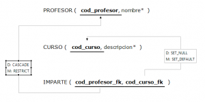

**KyBDele** es un editor gráfico para la elaboración de modelos E/R (Entidad-Relación) y Grafos Relacionales que está construido sobre la plataforma Eclipse, utilizando las facilidades proporcionadas por EMF y GMF para el desarrollo de herramientas de modelado.

A modo de ejemplo, la siguiente figura muestra la captura de un modelo elaborado con KyBDele – E/R.

Y a continuación un pequeño Grafo Relacional elaborado con KyBDele – Relational.

