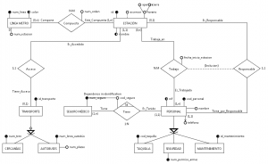

# About
**KyBDele** es un editor gráfico para la elaboración de modelos E/R (Entidad-Relación) y Grafos Relacionales que está construido sobre la plataforma Eclipse, utilizando las facilidades proporcionadas por EMF y GMF para el desarrollo de herramientas de modelado.

A modo de ejemplo, la siguiente figura muestra la captura de un modelo elaborado con KyBDele – E/R.

Y a continuación un pequeño Grafo Relacional elaborado con KyBDele – Relational.

# Motivación
Uno de los objetivos principales de las asignaturas básicas relacionadas con las Bases de Datos es que los alumnos dominen el proceso de desarrollo “tradicional” de una Base de Datos. En general, dicho proceso parte de la elaboración de un modelo conceptual de la Base de Datos que luego se transforma en un modelo lógico (más próximo a la implementación final) y finalmente se plasma en un esquema SQL.

Desafortunadamente, apenas existen herramientas para la elaboración de estos modelos, al menos herramientas que soporten las notaciones tradicionalmente utilizadas en el ámbito académico ([notación E/R original de Chen para modelos conceptuales](http://en.wikipedia.org/wiki/Entity%E2%80%93relationship_model#Diagramming_conventions) y [grafos relacionales](http://ocw.uc3m.es/ingenieria-informatica/fundamentos-de-bases-de-datos/material-practicas/SolucionRelacionalCasoPractico0708.pdf) para el modelo lógico). **KyBDele** nace con la intención de paliar este problema, proporcionando, en su primera release, un entorno de modelado para la elaboración de modelos E/R extendidos utilizando la notación original de Chen (KyDBele – E/R). Actualmente, la segunda release de la herramienta integra ya ofrece soporte para la elaboración de modelos relacionales expresados con la mencionada notación de grafo relacional (KyBDele – Relational).

Conviene destacar que **KyBDele** es una herramienta que está siendo desarrollada por los propios estudiantes bajo la supervisión de algunos profesores del grupo de investigación Kybele, y por tanto se encuentra en “fase experimental”. No obstante, los primeros contactos con la herramienta resultan prometedores.

Si quieres probar **KyBDele**, en la sección Descarga e Instalación encontrarás las instrucciones de descarga e instalación. Una vez instalada, la ayuda contextual de Eclipse incluye un manual completo de la herramienta. Además, en la sección Tutoriales encontrarás varios videotutoriales que muestran como utilizar la herramienta.
